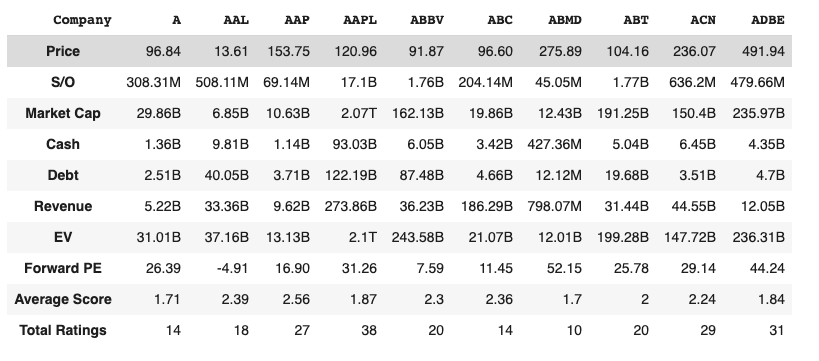

# Yahoo Finance Stocks

This project pulls S&P 500 stock data from Yahoo Finance into a Python notebook for analysis and learing. It also sends an email to me daily containing information about specific stocks.

This project was modified from [here](https://towardsdatascience.com/parse-thousands-of-stock-recommendations-in-minutes-with-python-6e3e562f156d)

## Tech Stack

- Python with Pandas
- Amazon SES
- AWS EC2 with daily cronjob

## Example Dataframe

## Author
Jonathan Nocek - *jnocek@iwu.edu*
